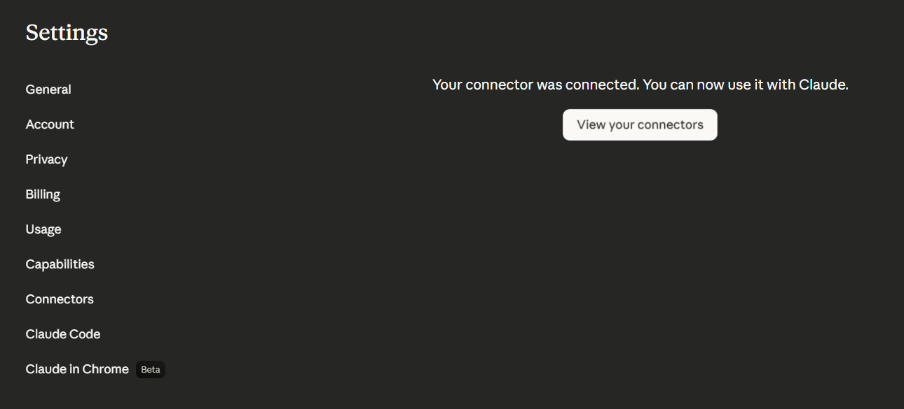
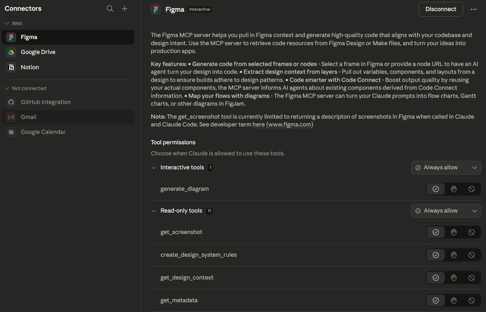
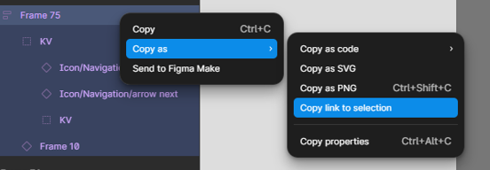
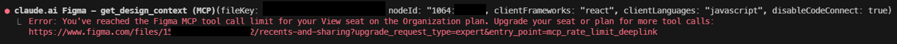
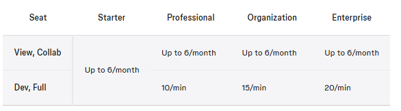

claude plugin install figma@claude-plugins-official

完成 OAuth 認證

安裝後，在 Claude Code 裡輸入 /mcp，選擇 figma，點選 Authenticate，完成瀏覽器 OAuth 登入流程，看到「Authentication successful. Connected to figma」就完成了。

在 Figma 中選取該元件後，複製連結（右鍵 → Copy link to selection）

然後貼到 Claude Code 的對話裡，並大概跟他說: 請根據這個 Figma 元件連結，幫我生成對應的 component，我的 component 要叫甚麼名稱、放在哪個資料夾、要支援哪些 props 和功能，之後就坐等元件生出來了。

後來遇到了這個錯誤

去查了資料，才發現因為我們一般工程師的帳號是只有 view seat ，所以一個月只能用 6 次。

