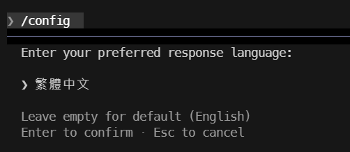
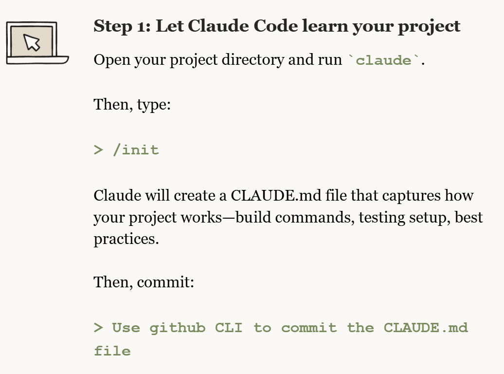
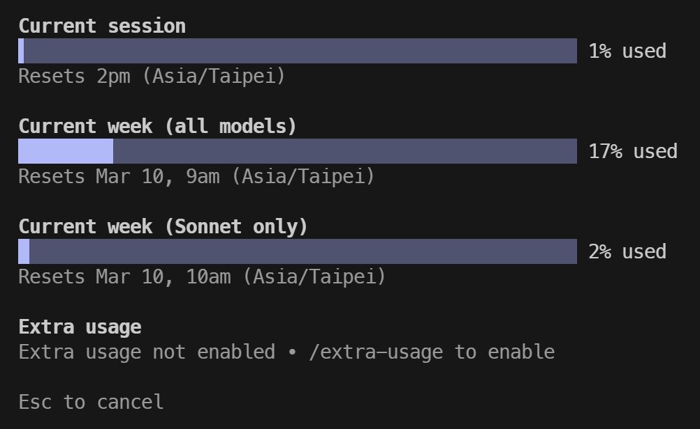

windows powershell 安裝

```
irm https://claude.ai/install.ps1 | iex
```

目前版本和安裝位置
Version: 2.1.63

Location: D:\Users\myName\.local\bin\claude.exe

第一步: 設定語言為繁體中文

```
/config
```

找到 language 直接輸入繁體中文



第二步: 我是看 claude 發的電子報教學建議在已存在的專案執行



```
/init
```

他會掃描整個專案，並根據專案的語言、框架、程式內容，自動幫你生成合適的 CLAUDE.md 檔案。

這是我用了四天
遷移一個專案的使用量


