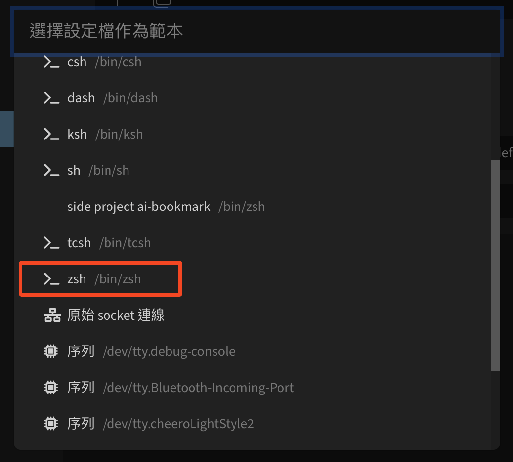
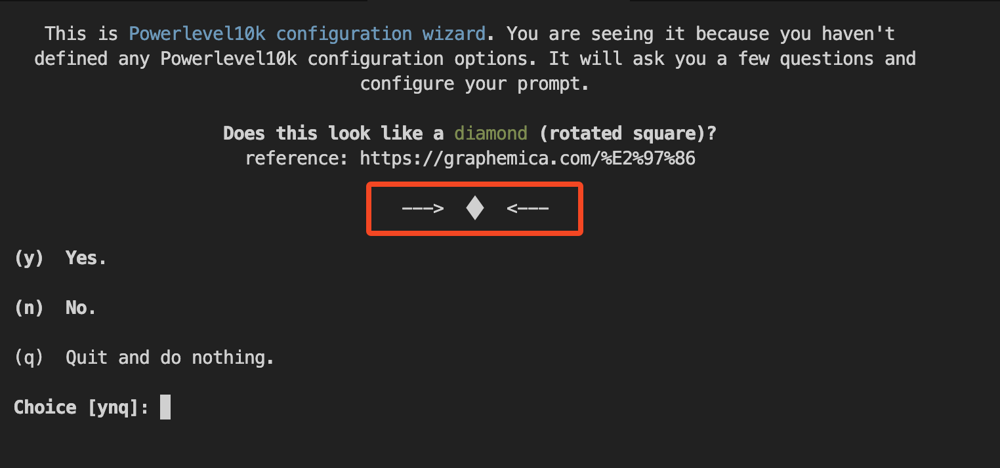

## 前言

> 一開始是因為前陣子公司在查每個人使用的軟體 license，才發現我之前使用的那個終端機軟體是允許個人使用，但在公司的個人使用上有模糊地帶
> ，為了避免爭議找了一下資料才發現有 Tabby 可以使用，而且它是 MIT License
> 也剛好解決了我在家的 macOS 以及公司 windows 終端機要切換習慣上的的問題

> 一部分也是因為工作變複雜了，需要的指令也變多，我正好在找一個可以自動補全指令或使用過去指令的工具才發現裝外掛就可以了

## 安裝和設定的步驟

1. 安裝zsh和oh-my-zsh（原本就安裝過所以略過這步驟）

- 檢查方式：
  ```bash
  echo $SHELL
  ```
  如果出現 /bin/zsh 就表示已經安裝

2. 安裝 Oh My Zsh plugins

- 安裝 autosuggestions

  ```bash
  git clone https://github.com/zsh-users/zsh-autosuggestions \
  ${ZSH_CUSTOM:-$ZSH/custom}/plugins/zsh-autosuggestions
  ```

- 安裝 syntax highlighting
  ```bash
  git clone https://github.com/zsh-users/zsh-syntax-highlighting \
  ${ZSH_CUSTOM:-$ZSH/custom}/plugins/zsh-syntax-highlighting
  ```
- 確認是否有安裝成功
  ```bash
  ls ~/.oh-my-zsh/custom/plugins
  ```

3. 安裝大家推薦的zsh主題 - powerlevel10k
   ```bash
   git clone --depth=1 https://github.com/romkatv/powerlevel10k.git \
   ${ZSH_CUSTOM:-$ZSH/custom}/themes/powerlevel10k
   ```
4. 設定 .zshrc
   ```bash
   nano ~/.zshrc
   ```
   在文件中找到 ZSH_THEME 並將其修改為 ZSH_THEME="powerlevel10k/powerlevel10k"
   ```bash
   ZSH_THEME="powerlevel10k/powerlevel10k"
   ```
   在文件中找到 plugins 加上 zsh-autosuggestions 和 zsh-syntax-highlighting
   ```bash
   plugins=(
     git
     z
     zsh-autosuggestions
     zsh-syntax-highlighting
   )
   ```
5. 套用設定
   ```bash
   source ~/.zshrc
   ```
6. 安裝 Nerd Font，是 powerlevel10k主題推薦安裝字體。
   ```bash
   brew install --cask font-meslo-lg-nerd-font
   ```
7. 設定 Tabby

- 將預設字體改為 MesloLGMonoNerdFont（或稱 MesloLGS NF）
- 設定預設開啟使用的 shell 為 zsh
  
- 或許未來會增加更多設定，所以從原本內建的zsh切一個設定出來，避免到時候還要煩惱要怎麼切也避免污染初始設定
  
  
-

8. 完全關閉 Tabby 再重新啟動
9. powerlevel10k的初始化設定
   

- 如果在這畫面的中間不是看到菱形◆代表Nerd Font沒有正確套用
- 顯示正確就照指令按y
- 繼續後面幾個字型測驗回答
- 繼續選擇一些樣式設定偏好

10. 完全關閉 Tabby 再重新啟動
