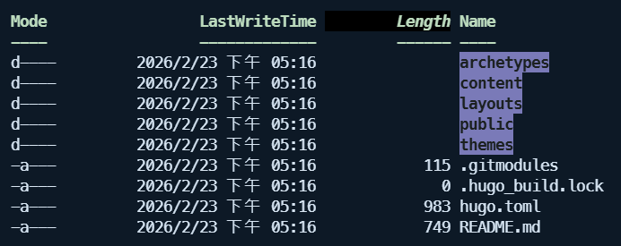

[上一篇：Tabby的zsh設定和安裝外掛]()

## 前言

因為公司使用的是WINDOWS系統，我一直懶得去設定windows的powershell提示，直到 [上一篇：Tabby的zsh設定和安裝外掛]() 都做了，想說也讓windows的powershell也有同樣的提示指令功能好了，所以就來研究一下 Tabby 要怎麼設定提示。

## 安裝 PowerShell 7

- 因為我想要有語法高亮、自動補全、歷史指令的功能，AI建議我使用 PSReadLine 模組，並且說 PowerShell 7 提供的 PSReadLine 模組更完整，所以就來安裝 PowerShell 7。

- 先檢查 PowerShell 版本
  ```PowerShell
  $PSVersionTable.PSVersion
  ```
- 使用 PowerShell 5安裝 PowerShell 7
  ```PowerShell
  winget install Microsoft.PowerShell
  ```
- 再執行一次 $PSVersionTable.PSVersion 看到 Major 7 就表示安裝成功

## 設定 Tabby 預設開啟 PowerShell 7 設定檔

- 可以參考 [上一篇：Tabby的zsh設定和安裝外掛]() 的設定方式
- 設定檔與連線 > 新增設定檔 > 選 PowerShell pwsh.exe
- 設定名稱、程式、參數
  
- 設定完以後，重新開啟分頁執行指令確認版本是否為7，是的話就成功了
  ```PowerShell
  $PSVersionTable.PSVersion
  ```

## 安裝 Oh My Posh

- 在 PowerShell 7 中安裝 Oh My Posh
  ```PowerShell
  winget install JanDeDobbeleer.OhMyPosh --source winget
  ```
- 安裝完，重新開啟分頁，執行指令確認是否安裝成功
  ```PowerShell
  oh-my-posh --version
  ```

## 為了讓 Oh My Posh 可以正確顯示不亂碼，需要安裝Nerd Font字型

    ```PowerShell
    oh-my-posh font install meslo
    ```

- 安裝完會出現一長串跟 meslo 字型相關清單，選擇 MesloLGS Nerd Font

## 將Tabby的字型改為MesloLGS Nerd Font (或稱MesloLGS NF)

## 建立 PowerShell Profile

    ```PowerShell
    notepad $PROFILE
    ```

- 如果沒有 $PROFILE，會自動建立一個
- 如果有 $PROFILE，會直接用記事本打開
- 加入下面的設定

  ```PowerShell
  # --- Oh My Posh ---
  # 使用內建主題
  # 可以在這換成其他主題名稱
  # 改完存檔以後可以執行 . $PROFILE 立刻套用
  #oh-my-posh init pwsh --config "blue-owl" | Invoke-Expression
  oh-my-posh init pwsh --config "takuya" | Invoke-Expression

  # --- PSReadLine (autosuggest / prediction / better editing) ---
  Import-Module PSReadLine

  # 讓預測（自動建議）來源使用 History（或支援時用 HistoryAndPlugin）
  # ViewStyle 可用 InlineView（像灰字在後面）或 ListView（像下拉列表）
  Set-PSReadLineOption -PredictionSource History -PredictionViewStyle InlineView

  # Tab 補全更像常見 shell：按 Tab 會循環候選
  Set-PSReadLineKeyHandler -Key Tab -Function MenuComplete

  ```

- 主題可以到 [Oh My Posh Themes](https://ohmyposh.dev/docs/themes) 找
- 立即載入設定
  ```PowerShell
  . $PROFILE
  ```

## 設定常用資料夾快速跳轉與 alias

- 打開 profile

  ```PowerShell
  notepad $PROFILE
  ```

  或需要用編輯器打開可以執行 $PROFILE 指令找檔案路徑

  ```PowerShell
  $PROFILE
  ```

- 在 profile 加入下面的設定
  ```PowerShell
  function blog { cd D:\Users\myName\Repos\dev-blog }
  ```
- 之後值些執行 blog 就可以快速跳轉到 dev-blog 資料夾

- 在 profile 加入下面的設定
  ```PowerShell
  function ydev { yarn local:DEV }
  ```
- 之後值些執行 ydev 就可以快速執行 yarn local:DEV

## 增強 ls 顯示

- 安裝 Terminal-Icons

  ```PowerShell
  Install-Module Terminal-Icons -Scope CurrentUser
  ```

- 在 profile 加入下面的設定

  ```PowerShell
  Import-Module Terminal-Icons
  ```

- 原本的 ls
  

- 增強的 ls
  

## 最後 profile 的設定

```PowerShell

# --- Oh My Posh ---
# 使用內建主題
# 可以在這換成其他主題名稱
# 改完存檔以後可以執行 . $PROFILE 立刻套用
#oh-my-posh init pwsh --config "blue-owl" | Invoke-Expression
oh-my-posh init pwsh --config "takuya" | Invoke-Expression

# --- PSReadLine (autosuggest / prediction / better editing) ---
Import-Module PSReadLine

# 讓預測（自動建議）來源使用 History（或支援時用 HistoryAndPlugin）
# ViewStyle 可用 InlineView（像灰字在後面）或 ListView（像下拉列表）
Set-PSReadLineOption -PredictionSource History -PredictionViewStyle InlineView

# Tab 補全更像常見 shell：按 Tab 會循環候選
Set-PSReadLineKeyHandler -Key Tab -Function MenuComplete


# ===== alias =====
function repo { cd D:\Users\myName\Repos }
function blog { cd D:\Users\myName\Repos\dev-blog }

function ydev { yarn local:DEV }
function yws { yarn local:DEV }

# --- Terminal Icons ---
Import-Module Terminal-Icons

```
